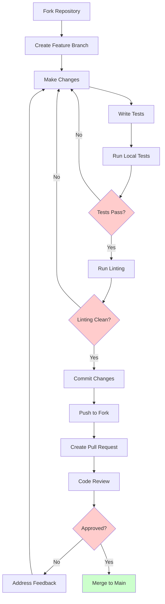
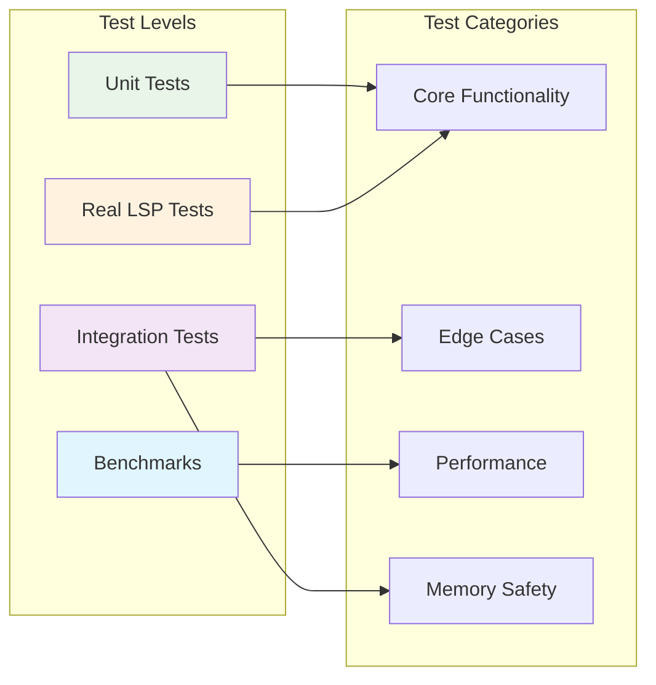

# Contributing to LSP Bridge

Thank you for considering contributing to LSP Bridge! This document outlines the process for contributing to the project and how to get started as a new contributor.

## Code of Conduct

This project adheres to the Rust community [Code of Conduct](https://www.rust-lang.org/policies/code-of-conduct). By participating, you are expected to uphold this code.

## Getting Started

### Prerequisites

- Rust (stable version 1.64 or higher)
- Cargo
- Git
- For integration tests: 
  - rust-analyzer (`cargo install rust-analyzer`)
  - typescript-language-server (`npm install -g typescript-language-server`)

### Development Environment Setup

1. Clone the repository:
   ```bash
   git clone https://github.com/your-username/lsp-bridge.git
   cd lsp-bridge
   ```

2. Install development dependencies:
   ```bash
   # Install formatting and linting tools
   rustup component add rustfmt clippy
   
   # Install cargo-nextest for better test output (optional)
   cargo install cargo-nextest
   ```

3. Build the project:
   ```bash
   cargo build
   ```

4. Run tests:
   ```bash
   cargo test
   # Or with nextest:
   cargo nextest run
   ```

5. Run linting and formatting:
   ```bash
   cargo clippy -- -D warnings
   cargo fmt --check
   ```

## Project Structure

```
LSPBridge/
├── src/                    # Core library code
│   ├── bridge.rs          # Main bridge interface
│   ├── client.rs          # Client-side LSP implementation
│   ├── server.rs          # Server lifecycle management
│   ├── protocol.rs        # LSP protocol types and handling
│   ├── process.rs         # Process management
│   ├── config.rs          # Configuration types
│   ├── error.rs           # Error types and handling
│   ├── monitoring.rs      # Performance monitoring
│   ├── hardening.rs       # Security and robustness
│   └── utils.rs           # Utility functions
├── tests/                 # Integration tests
├── examples/              # Usage examples
├── benches/               # Performance benchmarks
└── docs/                  # Documentation
```

## Development Workflow

### Contribution Process



### Testing Strategy



## Architecture Overview

LSP Bridge is designed with a modular architecture focusing on:

- **Bridge**: Main coordination layer that manages multiple LSP servers
- **Client**: Handles client-side LSP protocol implementation
- **Server**: Manages individual LSP server lifecycles and communication
- **Protocol**: Type-safe LSP message handling
- **Process**: Robust process management with proper cleanup

### Key Design Principles

1. **Async/Await**: All I/O operations use tokio async runtime
2. **Error Handling**: Comprehensive error types with context
3. **Thread Safety**: Uses `DashMap` and `Arc<RwLock<>>` for safe concurrency
4. **Resource Management**: Proper cleanup and resource limits
5. **Observability**: Built-in monitoring and logging with `tracing`

See the [Architecture Document](./docs/ARCHITECTURE.md) for detailed design information.

## Development Guidelines

### Code Style

- Follow standard Rust formatting (enforced by `cargo fmt`)
- Use meaningful names for types, functions, and variables
- Prefer composition over complex inheritance patterns
- Use builder patterns for complex configuration
- Handle all error cases explicitly with proper context

### Testing

1. **Unit Tests**: Write tests for all public APIs
   ```rust
   #[cfg(test)]
   mod tests {
       use super::*;
       
       #[tokio::test]
       async fn test_your_feature() {
           // Test implementation
       }
   }
   ```

2. **Integration Tests**: Add tests to `tests/` directory for end-to-end scenarios

3. **Documentation Tests**: Include code examples in documentation
   ```rust
   /// Example usage:
   /// ```
   /// use lsp_bridge::LspBridge;
   /// 
   /// let bridge = LspBridge::new();
   /// ```
   ```

### Documentation

- All public APIs must have comprehensive documentation
- Include examples for complex functions
- Use `cargo doc` to verify documentation builds correctly
- Document error conditions and edge cases

### Performance

- Use `cargo bench` to run benchmarks
- Profile memory usage for long-running operations
- Consider resource limits and cleanup paths
- Test with multiple concurrent servers

## Pull Request Process

1. Fork the repository
2. Create a feature branch (`git checkout -b feature/your-feature`)
3. Make your changes
4. Run tests (`cargo test`) and ensure they pass
5. Update documentation as needed
6. Commit your changes (`git commit -am 'Add some feature'`)
7. Push to your branch (`git push origin feature/your-feature`)
8. Create a new Pull Request

### Coding Guidelines

- Follow the Rust API Guidelines: https://rust-lang.github.io/api-guidelines/
- All public API must have comprehensive documentation with examples
- Ensure code passes `cargo clippy` without warnings
- Format code with `cargo fmt`
- Write tests for new functionality
- Maintain backward compatibility where possible

### Commit Message Format

Use the conventional commit format:

```
<type>(<scope>): <subject>

<body>

<footer>
```

Types include: `feat`, `fix`, `docs`, `style`, `refactor`, `perf`, `test`, `chore`

Example: `feat(server): add support for workspace symbols`

## Testing

- Write unit tests for all new functionality
- When fixing bugs, add regression tests
- For LSP server integration tests, make them resilient to different server versions
- Use mocking for tests that don't need real LSP server instances

## Documentation

- Document all public API
- Include examples in documentation
- Keep README up-to-date with new features
- Write clear and concise commit messages

## Release Process

The maintainers follow semantic versioning for releases:

- MAJOR version for incompatible API changes
- MINOR version for new functionality in a backwards compatible manner
- PATCH version for backwards compatible bug fixes

## Questions?

If you have questions about contributing, please open an issue or discuss on the project's discussions page.
