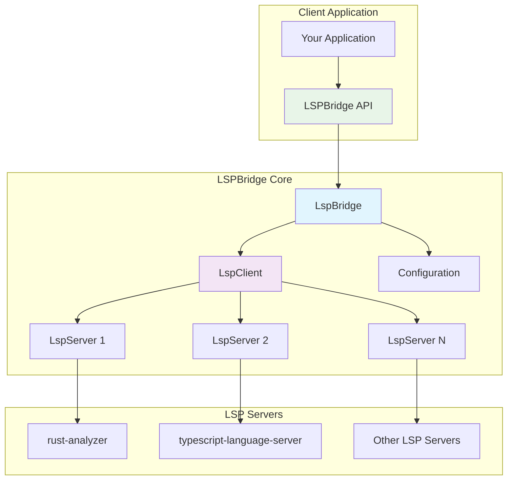
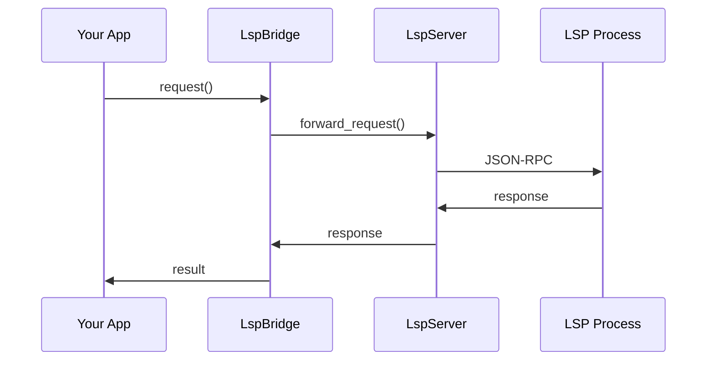

# LSP Bridge

[](https://crates.io/crates/lsp-bridge)
[](https://docs.rs/lsp-bridge)
[](LICENSE)
[](https://github.com/your-username/lsp-bridge/actions)

A comprehensive Rust library that provides a bridge between Language Server Protocol (LSP) servers and clients. It simplifies the integration of LSP capabilities into applications, tools, and IDEs by handling the complexity of protocol communication, lifecycle management, and feature negotiation.

## Features

- 🚀 **Complete LSP Protocol Support** - Full implementation of LSP 3.17+ specification
- 🔄 **Server Lifecycle Management** - Automatic startup, shutdown, and crash recovery
- ⚡ **Asynchronous Communication** - Built on Tokio for high-performance async operations
- 🎯 **Automatic Capability Detection** - Negotiates and adapts to server capabilities
- 🔗 **Request/Notification Routing** - Intelligent message routing and multiplexing
- 🧩 **Custom LSP Extensions** - Support for custom LSP extensions and protocols
- 📝 **Document Synchronization** - Automatic document state management
- 🎨 **Content Formatting** - Built-in support for document formatting
- 💡 **Smart Completion** - Advanced completion handling and filtering
- 🔍 **Symbol Search** - Project-wide symbol search and navigation
- 🩺 **Diagnostics Collection** - Comprehensive error and warning reporting
- 🏗️ **Multi-Server Coordination** - Manage multiple LSP servers simultaneously
- 📊 **Performance Profiling** - Built-in profiling of LSP operations

## Quick Start

Add this to your `Cargo.toml`:

```toml
[dependencies]
lsp-bridge = "0.1"
tokio = { version = "1.0", features = ["full"] }
```

## Basic Usage

```rust
use lsp_bridge::{LspBridge, LspServerConfig};
use lsp_types::{Position, CompletionParams, TextDocumentIdentifier};

#[tokio::main]
async fn main() -> Result<(), Box<dyn std::error::Error>> {
    // Configure an LSP server
    let rust_analyzer_config = LspServerConfig::new()
        .command("rust-analyzer")
        .root_path("/path/to/project")
        .initialization_options(serde_json::json!({
            "checkOnSave": {
                "command": "clippy"
            }
        }))
        .workspace_folder("/path/to/project");
    
    // Create the LSP bridge
    let mut bridge = LspBridge::new();
    
    // Register and start the server
    let server_id = bridge.register_server("rust", rust_analyzer_config).await?;
    bridge.start_server(&server_id).await?;
    
    // Wait for server to be ready
    bridge.wait_server_ready(&server_id).await?;
    
    // Open a document
    let document_uri = "file:///path/to/project/src/main.rs";
    let content = "fn main() {\n    println!(\"Hello, world!\");\n}";
    bridge.open_document(&server_id, document_uri, content).await?;
    
    // Get completions
    let completions = bridge.get_completions(
        &server_id,
        document_uri,
        Position { line: 1, character: 15 }
    ).await?;
    
    for item in completions {
        println!("Completion: {}", item.label);
    }
    
    // Get diagnostics
    let diagnostics = bridge.get_diagnostics(&server_id, document_uri)?;
    for diagnostic in diagnostics {
        println!("Diagnostic: {}", diagnostic.message);
    }
    
    // Shutdown
    bridge.shutdown().await?;
    
    Ok(())
}
```

## Advanced Usage

### Multiple Servers

```rust
use lsp_bridge::{LspBridge, LspServerConfig};

#[tokio::main]
async fn main() -> Result<(), Box<dyn std::error::Error>> {
    let mut bridge = LspBridge::new();
    
    // Configure multiple servers
    let rust_config = LspServerConfig::new()
        .command("rust-analyzer")
        .root_path("/path/to/rust/project");
    
    let python_config = LspServerConfig::new()
        .command("pylsp")
        .root_path("/path/to/python/project");
    
    // Register servers
    let rust_server = bridge.register_server("rust", rust_config).await?;
    let python_server = bridge.register_server("python", python_config).await?;
    
    // Start servers
    bridge.start_server(&rust_server).await?;
    bridge.start_server(&python_server).await?;
    
    // Use different servers for different file types
    bridge.open_document(&rust_server, "file:///project/src/main.rs", "fn main() {}").await?;
    bridge.open_document(&python_server, "file:///project/main.py", "print('hello')").await?;
    
    Ok(())
}
```

### Custom Requests and Notifications

```rust
use lsp_bridge::{LspBridge, LspServerConfig};
use lsp_types::{request::Request, notification::Notification};

// Define custom request
#[derive(Debug)]
enum CustomRequest {}

impl Request for CustomRequest {
    type Params = serde_json::Value;
    type Result = serde_json::Value;
    const METHOD: &'static str = "custom/request";
}

#[tokio::main]
async fn main() -> Result<(), Box<dyn std::error::Error>> {
    let mut bridge = LspBridge::new();
    let server_id = bridge.register_server("custom", LspServerConfig::new().command("custom-server")).await?;
    bridge.start_server(&server_id).await?;
    
    // Send custom request
    let params = serde_json::json!({"key": "value"});
    let response = bridge.request::<CustomRequest>(&server_id, params).await?;
    println!("Custom response: {:?}", response);
    
    Ok(())
}
```

### Error Handling and Recovery

```rust
use lsp_bridge::{LspBridge, LspServerConfig, LspError};

#[tokio::main]
async fn main() -> Result<(), Box<dyn std::error::Error>> {
    let mut bridge = LspBridge::new();
    let config = LspServerConfig::new()
        .command("language-server")
        .max_restart_attempts(3)
        .restart_delay(std::time::Duration::from_secs(2));
    
    let server_id = bridge.register_server("lang", config).await?;
    
    // Handle server startup errors
    match bridge.start_server(&server_id).await {
        Ok(_) => println!("Server started successfully"),
        Err(LspError::ServerStartup { message }) => {
            eprintln!("Failed to start server: {}", message);
            // Attempt restart
            bridge.restart_server(&server_id).await?;
        }
        Err(e) => return Err(e.into()),
    }
    
    Ok(())
}
```

## Configuration

### Server Configuration

```rust
use lsp_bridge::LspServerConfig;
use std::time::Duration;

let config = LspServerConfig::new()
    .command("rust-analyzer")
    .args(["--help"])
    .working_directory("/path/to/project")
    .env("RUST_LOG", "debug")
    .root_path("/path/to/project")
    .workspace_folders(["/path/to/project", "/path/to/workspace"])
    .startup_timeout(Duration::from_secs(30))
    .request_timeout(Duration::from_secs(30))
    .max_restart_attempts(3)
    .restart_delay(Duration::from_secs(2))
    .initialization_options(serde_json::json!({
        "cargo": {
            "buildScripts": {
                "enable": true
            }
        }
    }));
```

### Client Capabilities

```rust
use lsp_bridge::{LspServerConfig, LspClientCapabilities};

let capabilities = LspClientCapabilities {
    text_document: TextDocumentClientCapabilities {
        completion: Some(CompletionClientCapabilities {
            completion_item: Some(CompletionItemCapability {
                snippet_support: Some(true),
                commit_characters_support: Some(true),
                ..Default::default()
            }),
            ..Default::default()
        }),
        ..Default::default()
    },
    ..Default::default()
};

let config = LspServerConfig::new()
    .command("language-server")
    .client_capabilities(capabilities);
```

## Supported LSP Features

- ✅ **Text Document Synchronization** - Open, close, change notifications
- ✅ **Completion** - Code completion with filtering and sorting
- ✅ **Hover** - Symbol information on hover
- ✅ **Signature Help** - Function signature assistance
- ✅ **Go to Definition** - Navigate to symbol definitions
- ✅ **Go to Type Definition** - Navigate to type definitions
- ✅ **Go to Implementation** - Navigate to implementations
- ✅ **Find References** - Find all symbol references
- ✅ **Document Highlighting** - Highlight related symbols
- ✅ **Document Symbols** - List symbols in document
- ✅ **Code Actions** - Quick fixes and refactoring
- ✅ **Code Lens** - Inline actionable information
- ✅ **Document Links** - Clickable links in documents
- ✅ **Document Formatting** - Format entire document
- ✅ **Range Formatting** - Format selected range
- ✅ **On Type Formatting** - Format on character input
- ✅ **Rename** - Rename symbols across workspace
- ✅ **Folding Range** - Code folding information
- ✅ **Selection Range** - Smart selection expansion
- ✅ **Workspace Symbols** - Search symbols across workspace
- ✅ **Execute Command** - Execute custom commands
- ✅ **Diagnostics** - Error and warning reporting
- ✅ **Progress Reporting** - Operation progress notifications

## Language Server Examples

### Rust (rust-analyzer)

```rust
let config = LspServerConfig::new()
    .command("rust-analyzer")
    .initialization_options(serde_json::json!({
        "checkOnSave": {
            "command": "clippy"
        },
        "cargo": {
            "buildScripts": {
                "enable": true
            }
        }
    }));
```

### Python (pylsp)

```rust
let config = LspServerConfig::new()
    .command("pylsp")
    .initialization_options(serde_json::json!({
        "plugins": {
            "pycodestyle": {"enabled": false},
            "mccabe": {"enabled": false},
            "pyflakes": {"enabled": false},
            "flake8": {
                "enabled": true,
                "maxLineLength": 88
            }
        }
    }));
```

### TypeScript (typescript-language-server)

```rust
let config = LspServerConfig::new()
    .command("typescript-language-server")
    .args(["--stdio"])
    .initialization_options(serde_json::json!({
        "preferences": {
            "disableSuggestions": false,
            "quotePreference": "double"
        }
    }));
```

## Architecture

### Overview



### Key Components

The LSP Bridge is organized into several key modules:

- **`bridge`** - Main interface coordinating client-server communication
- **`client`** - Client-side bridge implementation for LSP interactions  
- **`server`** - Server lifecycle management and communication
- **`protocol`** - LSP protocol implementation and message types
- **`config`** - Configuration types and builders
- **`error`** - Comprehensive error types and handling
- **`utils`** - Shared utilities and helper functions

### Communication Flow



For detailed architecture diagrams and component interactions, see [Architecture Diagrams](docs/ARCHITECTURE_DIAGRAMS.md).

## Error Handling

LSP Bridge provides comprehensive error handling with detailed error types:

```rust
use lsp_bridge::LspError;

match error {
    LspError::ServerStartup { message } => {
        // Handle server startup failures
    }
    LspError::Communication { message } => {
        // Handle communication errors
    }
    LspError::Timeout { timeout_ms } => {
        // Handle timeout errors
    }
    LspError::ServerCrash { server_id } => {
        // Handle server crashes
    }
    // ... other error types
}
```

## Performance

LSP Bridge is designed for high performance:

- **Async/Await** - Built on Tokio for efficient async operations
- **Concurrent Processing** - Multiple servers and requests handled concurrently
- **Smart Caching** - Intelligent caching of server capabilities and responses
- **Minimal Overhead** - Optimized message parsing and routing
- **Resource Management** - Automatic cleanup and resource management

## Testing

Run the test suite:

```bash
cargo test
```

Run with logging:

```bash
RUST_LOG=debug cargo test
```

Integration tests with real LSP servers:

```bash
cargo test --features integration-tests
```

## Documentation

### Architecture and Design

- **[Architecture Diagrams](docs/ARCHITECTURE_DIAGRAMS.md)** - Comprehensive visual documentation of system architecture, protocol flows, and component interactions
- **[Architecture Overview](docs/ARCHITECTURE.md)** - Detailed technical architecture and design principles
- **[Production Guide](docs/PRODUCTION_GUIDE.md)** - Complete guide for production deployment with LSP protocol flows

### API Reference

- **[API Documentation](https://docs.rs/lsp-bridge)** - Complete API reference with examples
- **[Examples](examples/)** - Working examples for common use cases
- **[Contributing Guide](CONTRIBUTING.md)** - Development workflow and contribution guidelines

### Visual Documentation

Our documentation includes comprehensive diagrams showing:

- **System Architecture** - High-level component organization
- **Protocol Flows** - LSP request/response and notification sequences
- **Server Lifecycle** - State transitions and error handling
- **Multi-Server Coordination** - How multiple LSP servers work together
- **Thread Safety** - Concurrency patterns and synchronization
- **Development Workflow** - Contributing and testing processes

## Contributing

We welcome contributions! Please see [CONTRIBUTING.md](CONTRIBUTING.md) for details.

### Development Setup

1. Clone the repository:

   ```bash
   git clone https://github.com/your-username/lsp-bridge.git
   cd lsp-bridge
   ```

2. Install dependencies:

   ```bash
   cargo build
   ```

3. Run tests:

   ```bash
   cargo test
   ```

4. Check formatting and linting:

   ```bash
   cargo fmt --check
   cargo clippy -- -D warnings
   ```

## Roadmap

- [ ] WebSocket transport support
- [ ] Language server discovery and auto-configuration
- [ ] Built-in language server implementations
- [ ] VS Code extension integration
- [ ] Performance benchmarking and optimization
- [ ] Advanced caching strategies
- [ ] Plugin system for custom extensions
- [ ] Docker container support
- [ ] Language server health monitoring
- [ ] Automatic server selection based on file type

## License

This project is licensed under either of

- Apache License, Version 2.0, ([LICENSE-APACHE](LICENSE-APACHE) or <http://www.apache.org/licenses/LICENSE-2.0>)
- MIT license ([LICENSE-MIT](LICENSE-MIT) or <http://opensource.org/licenses/MIT>)

at your option.

## Acknowledgments

- [Language Server Protocol](https://microsoft.github.io/language-server-protocol/) - Microsoft's LSP specification
- [lsp-types](https://github.com/gluon-lang/lsp-types) - Rust LSP types implementation
- [Tokio](https://tokio.rs/) - Asynchronous runtime for Rust
- [rust-analyzer](https://rust-analyzer.github.io/) - Inspiration for LSP server architecture

## Changelog

See [CHANGELOG.md](CHANGELOG.md) for details about changes in each release.
