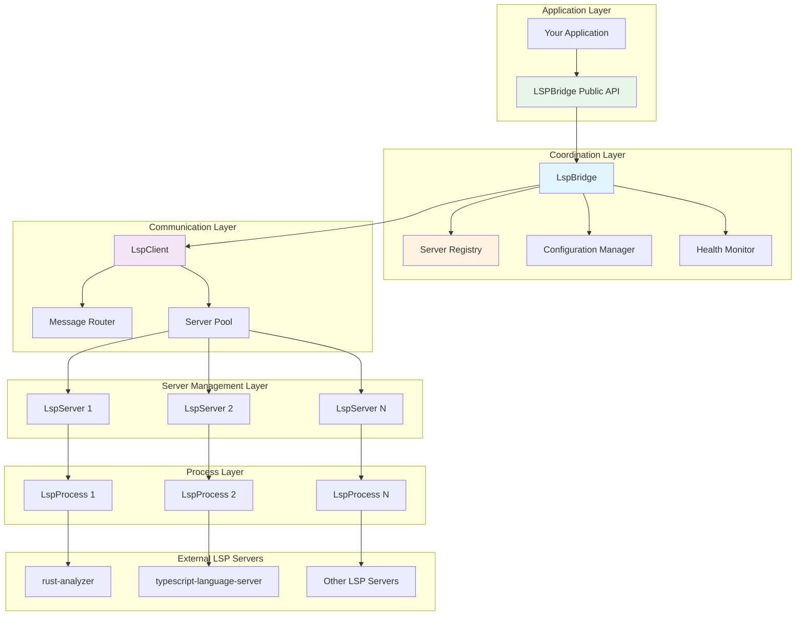

# LSP Bridge Architecture

This document provides a comprehensive overview of the LSP Bridge architecture, explaining how different components interact and the design principles behind the implementation.

## System Overview

LSP Bridge is a comprehensive Rust library that provides a bridge between Language Server Protocol (LSP) servers and clients. It abstracts away the complexity of LSP communication, server management, and protocol handling, providing a clean, type-safe interface for integrating LSP capabilities into applications.

## Design Principles

1. **Async/Await First**: All I/O operations use tokio's async runtime for maximum performance
2. **Type Safety**: Leverages Rust's type system and lsp-types crate for protocol safety
3. **Thread Safety**: Built with concurrent access in mind using `Arc`, `RwLock`, and `DashMap`
4. **Error Transparency**: Comprehensive error types with context and recovery information
5. **Resource Management**: Proper cleanup and resource limits to prevent leaks
6. **Observability**: Built-in monitoring and tracing for production debugging

## System Architecture

LSP Bridge uses a layered, modular architecture that separates concerns for better maintainability and flexibility:

### High-Level Architecture



### Layer Responsibilities
    │                      (LspClient)                                │
    │  ┌─────────────┐ ┌─────────────┐ ┌─────────────┐ ┌──────────┐  │
    │  │ Request     │ │ Response    │ │ Notification│ │ Document │  │
    │  │ Handling    │ │ Routing     │ │ Handling    │ │ State    │  │
    │  └─────────────┘ └─────────────┘ └─────────────┘ └──────────┘  │
    └─────────────────────────┬───────────────────────────────────────┘
                              │
    ┌─────────────────────────▼───────────────────────────────────────┐
    │                   Server Management Layer                       │
    │                      (LspServer)                                │
    │  ┌─────────────┐ ┌─────────────┐ ┌─────────────┐ ┌──────────┐  │
    │  │ Process     │ │ State       │ │ Capability  │ │ Message  │  │
    │  │ Management  │ │ Machine     │ │ Negotiation │ │ Protocol │  │
    │  └─────────────┘ └─────────────┘ └─────────────┘ └──────────┘  │
    └─────────────────────────┬───────────────────────────────────────┘
                              │
    ┌─────────────────────────▼───────────────────────────────────────┐
    │                   Process Communication                         │
    │                     (LspProcess)                                │
    │  ┌─────────────┐ ┌─────────────┐ ┌─────────────┐ ┌──────────┐  │
    │  │ Stdin/      │ │ JSON-RPC    │ │ Message     │ │ Error    │  │
    │  │ Stdout      │ │ Protocol    │ │ Framing     │ │ Recovery │  │
    │  │ Pipes       │ │             │ │             │ │          │  │
    │  └─────────────┘ └─────────────┘ └─────────────┘ └──────────┘  │
    └─────────────────────────┬───────────────────────────────────────┘
                              │
    ┌─────────────────────────▼───────────────────────────────────────┐
    │                   External LSP Servers                          │
    │    ┌─────────────┐    ┌─────────────┐    ┌─────────────┐        │
    │    │ rust-       │    │ typescript- │    │ Other LSP   │        │
    │    │ analyzer    │    │ language-   │    │ Servers     │        │
    │    │             │    │ server      │    │             │        │
    │    └─────────────┘    └─────────────┘    └─────────────┘        │
    └─────────────────────────────────────────────────────────────────┘
```

## Core Components

### 1. LspBridge (bridge.rs)
**Role**: Main coordination interface and entry point

**Responsibilities**:
- Server registration and lifecycle management
- Multi-server coordination and routing
- Document synchronization across servers
- Feature aggregation and conflict resolution
- Configuration management
- Error handling and recovery orchestration

**Key Methods**:
```rust
// Server management
register_server(id, config) -> Result<ServerId>
start_server(server_id) -> Result<()>
stop_server(server_id) -> Result<()>

// Document operations
open_document(server_id, uri, content) -> Result<()>
close_document(server_id, uri) -> Result<()>
update_document(server_id, uri, changes) -> Result<()>

// LSP features
get_completions(server_id, uri, position) -> Result<Vec<CompletionItem>>
get_hover(server_id, uri, position) -> Result<Option<Hover>>
go_to_definition(server_id, uri, position) -> Result<Option<Location>>
```

### 2. LspClient (client.rs)
**Role**: Client-side LSP protocol implementation

**Responsibilities**:
- Server registry and active server management
- Request/response correlation and routing
- Notification broadcasting
- Document state synchronization
- Client capability management

**Architecture**:
```rust
struct LspClient {
    servers: DashMap<ServerId, Arc<RwLock<LspServer>>>,
    active_server: Arc<RwLock<Option<ServerId>>>,
    documents: DashMap<String, DocumentState>,
}
```

### 3. LspServer (server.rs)
**Role**: Individual LSP server lifecycle and communication management

**Responsibilities**:
- Server process spawning and management
- Initialization and capability negotiation
- State machine management (Stopped → Starting → Initializing → Ready → ShuttingDown)
- Request/response handling with timeouts
- Crash detection and recovery
- Resource cleanup

**State Machine**:
```rust
enum ServerState {
    Stopped,      // Initial state, not running
    Starting,     // Process started, not yet initialized
    Initializing, // Initialization request sent
    Ready,        // Fully operational
    ShuttingDown, // Shutdown in progress
    Crashed,      // Process died unexpectedly
}
```

### 4. LspProcess (process.rs)
**Role**: Low-level process communication and JSON-RPC handling

**Responsibilities**:
- Stdin/stdout pipe management
- JSON-RPC message framing (Content-Length headers)
- Message serialization/deserialization
- Process monitoring and health checks
- Stream multiplexing and buffering

### 5. Protocol Types (protocol.rs)
**Role**: Type-safe LSP message definitions and utilities

**Components**:
- Request/Response/Notification types
- Document state management
- Position and range utilities
- URI handling and path conversion
- Message ID generation and tracking

### 6. Configuration (config.rs)
**Role**: Server configuration and validation

**Features**:
- Builder pattern for ergonomic configuration
- Validation with detailed error messages
- Default values and environment integration
- Timeout and resource limit configuration

### 7. Error Handling (error.rs)
**Role**: Comprehensive error types with context

**Error Categories**:
```rust
enum LspError {
    ServerNotFound { server_id: String },
    ServerStartup(String),
    Communication(String),
    Protocol(String),
    Timeout(u64),
    Io(String),
}
```

### 8. Monitoring (monitoring.rs)
**Role**: Performance monitoring and observability

**Features**:
- Request/response metrics
- Server health monitoring
- Resource usage tracking
- Performance counters
- Tracing integration

### 9. Security & Hardening (hardening.rs)
**Role**: Security features and robustness

**Features**:
- Input validation and sanitization
- Rate limiting and backpressure
- Resource limits and circuit breakers
- Connection limits and timeouts

### 3. LspClient (client.rs)

Implements the client-side of the LSP protocol:
- Request and notification sending
- Response handling
- Document state tracking
- Feature availability checking

### 4. LspProcess (process.rs)

Handles the low-level process management:
- Communication with external LSP server processes
- Message serialization/deserialization
- Stdin/stdout handling
- Process monitoring

### 5. Protocol (protocol.rs)

Defines the core protocol types and utilities:
- LSP message formats (requests, responses, notifications)
- JSON-RPC handling
- Document state tracking
- URI handling

### 6. Error Handling (error.rs)

Provides a comprehensive error system:
- Error type hierarchy
- Error conversion and propagation
- Recovery strategies
- Diagnostic information

## Communication Flow

1. **User Interaction**: A user interacts with `LspBridge`, calling methods like `register_server`, `open_document`, or `get_completions`

2. **Request Creation**: The bridge routes these requests to the appropriate `LspClient` instance

3. **Message Serialization**: The request is serialized into an LSP message format

4. **Process Communication**: The message is sent to the LSP server process via `LspProcess`

5. **Response Handling**: When the server responds, the message is deserialized and routed back to the awaiting request

6. **Result Delivery**: The result is returned to the user

## Server Lifecycle

```
┌─────────┐     ┌──────────┐     ┌─────────────┐     ┌───────┐
│ Stopped │────►│ Starting │────►│ Initializing│────►│ Ready │
└─────────┘     └──────────┘     └─────────────┘     └───┬───┘
     ▲                                                    │
     │                                                    │
┌────┴────┐     ┌────────────┐                           │
│ Crashed │◄────┤ShuttingDown│◄───────────────────────────┘
└─────────┘     └────────────┘
```

## Concurrency Model

LSP Bridge uses Tokio for asynchronous operation:
- Request/response handling is fully asynchronous
- Multiple servers can operate concurrently
- DashMap provides thread-safe concurrent collections
- Tokio tasks are used for background operations

## Document Synchronization

Document state is tracked and synchronized with LSP servers:
- Open/close notifications
- Content change notifications
- Version tracking
- Change events

## Feature Extensions

The codebase uses feature flags to enable optional LSP capabilities:
- Diagnostics collection
- Code completion
- Document formatting
- References and definitions
- Hover information
- Code actions
- Rename refactoring
- Workspace symbols

## Design Principles

1. **Robustness**: Error handling is comprehensive and servers can recover from crashes
2. **Performance**: Asynchronous operation and efficient message handling
3. **Flexibility**: Support for multiple server types and custom extensions
4. **Simplicity**: Clean API for users despite the complexity of the underlying protocol
5. **Testability**: Components are designed to be testable in isolation

## Future Architectural Directions

1. **Plugin System**: Allow for custom protocol extensions
2. **Cross-Language Support**: Better support for multi-language repositories
3. **Enhanced Diagnostics**: More comprehensive error reporting
4. **Performance Optimization**: Caching and incremental processing
