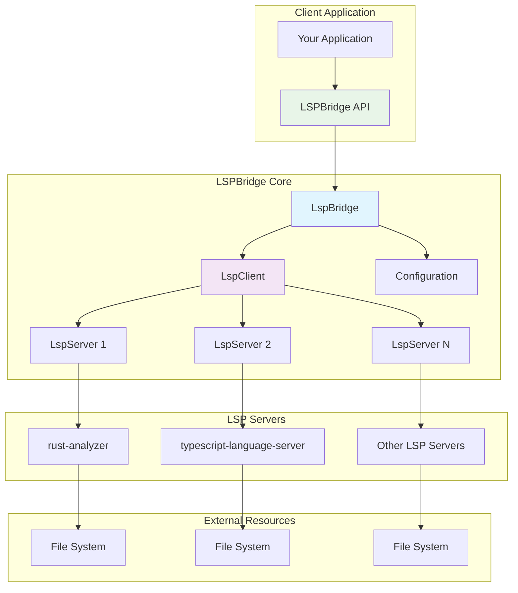
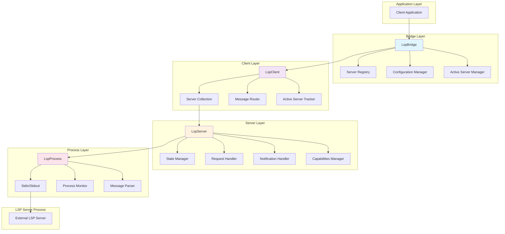
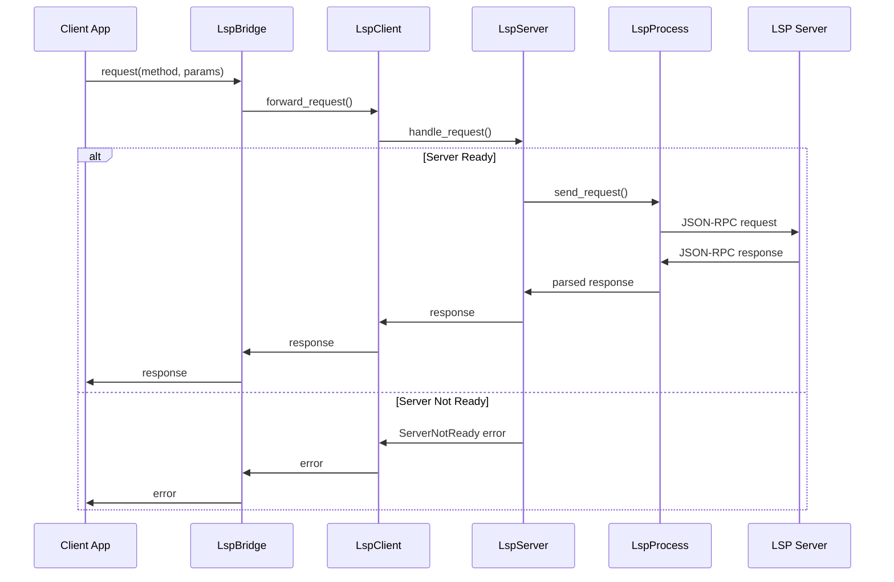
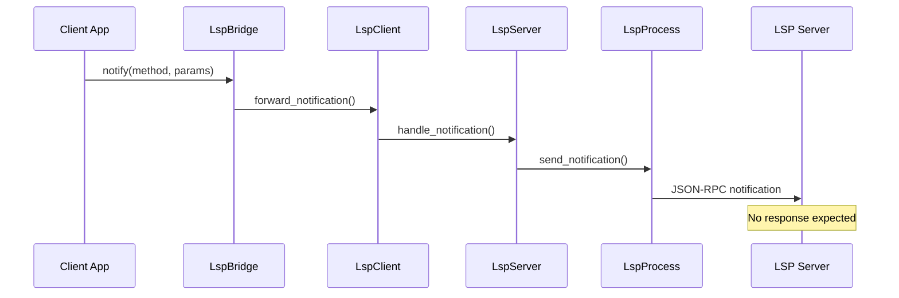
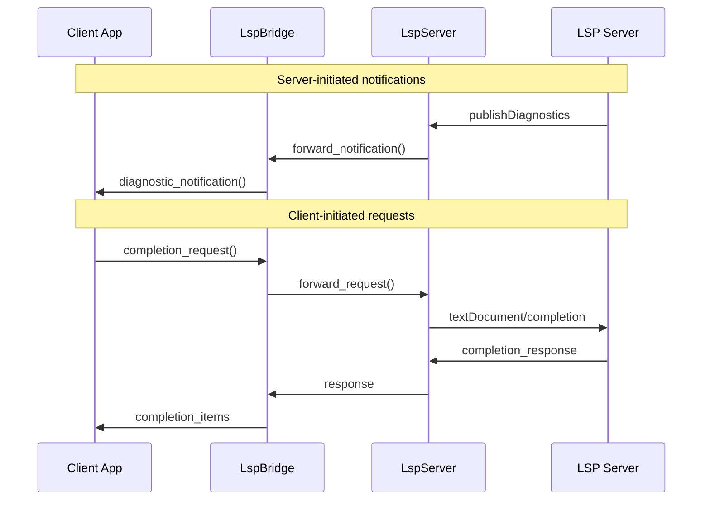
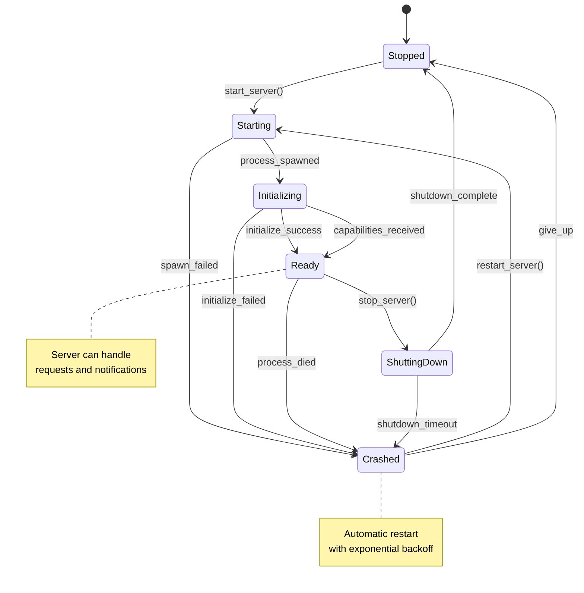
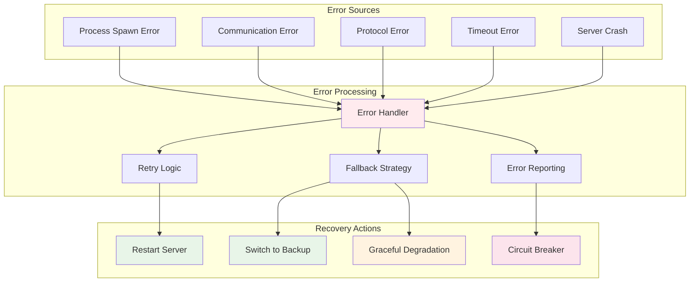
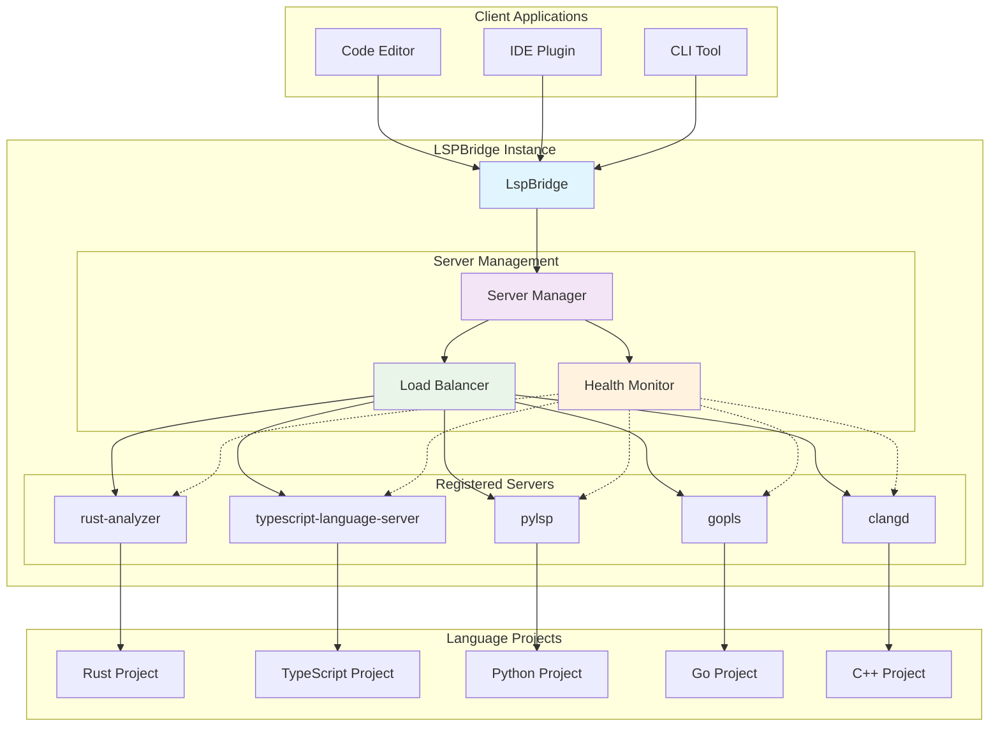
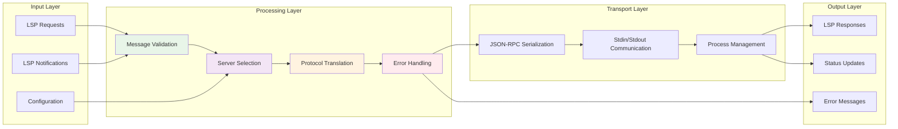
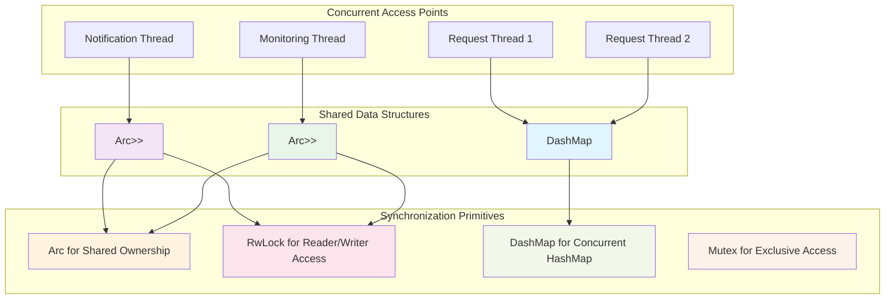

# LSPBridge Architecture Diagrams

This document provides visual representations of the LSPBridge architecture, component interactions, and protocol flows.

## Table of Contents

1. [High-Level Architecture](#high-level-architecture)
2. [Component Interaction Diagram](#component-interaction-diagram)
3. [LSP Protocol Flow](#lsp-protocol-flow)
4. [Server Lifecycle Management](#server-lifecycle-management)
5. [Error Handling Flow](#error-handling-flow)
6. [Multi-Server Architecture](#multi-server-architecture)

## High-Level Architecture

### Architecture Overview

- **LspBridge**: Main coordinator managing multiple LSP servers
- **LspClient**: Protocol implementation and server communication
- **LspServer**: Individual server lifecycle management
- **LspProcess**: Low-level process communication

## Component Interaction Diagram

## LSP Protocol Flow

### Request/Response Flow

### Notification Flow

### Bidirectional Communication

## Server Lifecycle Management

## Error Handling Flow

## Multi-Server Architecture

## Data Flow Architecture

## Thread Safety Architecture

---

## Diagram Legend

- **Blue boxes**: Main coordination components
- **Purple boxes**: Client/communication layers  
- **Orange boxes**: Server management components
- **Pink boxes**: Process and low-level components
- **Green boxes**: Successful operations/states
- **Red boxes**: Error conditions/handling
- **Dotted lines**: Monitoring/health check connections
- **Solid lines**: Direct communication paths

These diagrams provide a comprehensive visual understanding of the LSPBridge architecture, from high-level component organization to detailed protocol flows and error handling strategies.
