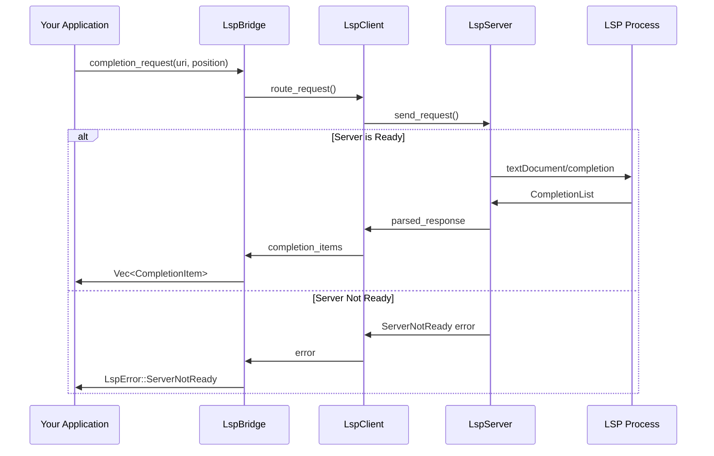
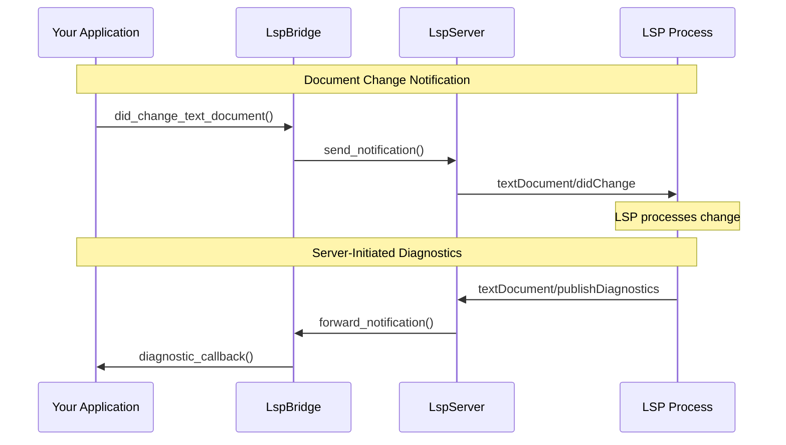
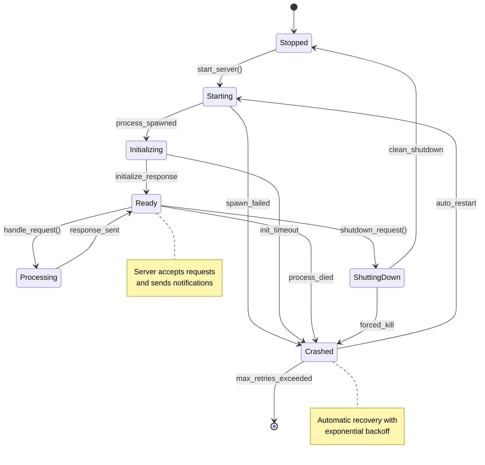
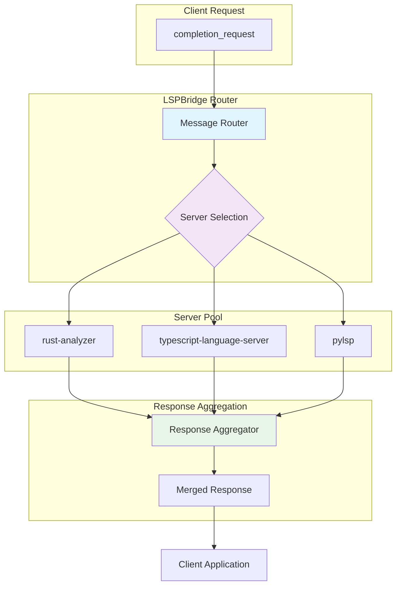

# Production Documentation Enhancement

This document outlines the comprehensive documentation enhancements for making the LSP Bridge production-ready.

## 1. Feature Examples Documentation

### Complete LSP Feature Examples

#### Document Synchronization
```rust
use lsp_bridge::{LspBridge, LspServerConfig};
use std::path::Path;

#[tokio::main]
async fn main() -> Result<(), Box<dyn std::error::Error>> {
    let mut bridge = LspBridge::new().await?;
    
    // Configure server for document synchronization
    let config = LspServerConfig::new()
        .command("rust-analyzer")
        .document_sync_kind(TextDocumentSyncKind::Incremental)
        .build();
    
    let server_id = bridge.register_server("rust-analyzer", config).await?;
    let file_uri = "file:///path/to/main.rs";
    
    // Open document
    bridge.did_open_text_document(server_id, file_uri, "rust", 1, 
        "fn main() {\n    println!(\"Hello, world!\");\n}").await?;
    
    // Make incremental changes
    bridge.did_change_text_document(server_id, file_uri, 2, vec![
        TextDocumentContentChangeEvent {
            range: Some(Range::new(Position::new(1, 4), Position::new(1, 4))),
            range_length: None,
            text: "// Added comment\n    ".to_string(),
        }
    ]).await?;
    
    // Save document
    bridge.did_save_text_document(server_id, file_uri, None).await?;
    
    // Close document
    bridge.did_close_text_document(server_id, file_uri).await?;
    
    Ok(())
}
```

#### Code Completion
```rust
use lsp_bridge::{LspBridge, LspServerConfig};
use lsp_types::{Position, CompletionContext, CompletionTriggerKind};

async fn completion_example() -> Result<(), Box<dyn std::error::Error>> {
    let mut bridge = LspBridge::new().await?;
    
    let config = LspServerConfig::new()
        .command("rust-analyzer")
        .completion_trigger_characters(vec![".".to_string(), "::".to_string()])
        .build();
    
    let server_id = bridge.register_server("rust-analyzer", config).await?;
    let file_uri = "file:///src/main.rs";
    
    // Open document
    bridge.did_open_text_document(server_id, file_uri, "rust", 1, 
        "fn main() {\n    std::\n}").await?;
    
    // Request completion at position after "std::"
    let position = Position::new(1, 9);
    let context = CompletionContext {
        trigger_kind: CompletionTriggerKind::TRIGGER_CHARACTER,
        trigger_character: Some("::".to_string()),
    };
    
    let completions = bridge.completion(server_id, file_uri, position, Some(context)).await?;
    
    for item in completions {
        println!("Completion: {} (kind: {:?})", item.label, item.kind);
        if let Some(detail) = item.detail {
            println!("  Detail: {}", detail);
        }
        if let Some(docs) = item.documentation {
            println!("  Documentation: {:?}", docs);
        }
    }
    
    Ok(())
}
```

#### Diagnostics Handling
```rust
use lsp_bridge::{LspBridge, LspServerConfig};
use lsp_types::{Diagnostic, DiagnosticSeverity};

async fn diagnostics_example() -> Result<(), Box<dyn std::error::Error>> {
    let mut bridge = LspBridge::new().await?;
    
    let config = LspServerConfig::new()
        .command("rust-analyzer")
        .publish_diagnostics(true)
        .build();
    
    let server_id = bridge.register_server("rust-analyzer", config).await?;
    
    // Set up diagnostics handler
    bridge.set_diagnostics_handler(move |uri, diagnostics| {
        println!("Diagnostics for {}: {} issues", uri, diagnostics.len());
        for diagnostic in diagnostics {
            let severity = match diagnostic.severity {
                Some(DiagnosticSeverity::ERROR) => "ERROR",
                Some(DiagnosticSeverity::WARNING) => "WARNING",
                Some(DiagnosticSeverity::INFORMATION) => "INFO",
                Some(DiagnosticSeverity::HINT) => "HINT",
                None => "UNKNOWN",
            };
            println!("  [{}] {}: {}", severity, diagnostic.range, diagnostic.message);
        }
    });
    
    // Open document with syntax error
    let file_uri = "file:///src/main.rs";
    bridge.did_open_text_document(server_id, file_uri, "rust", 1, 
        "fn main() {\n    let x = \n}").await?; // Missing semicolon
    
    // Wait for diagnostics
    tokio::time::sleep(tokio::time::Duration::from_millis(500)).await;
    
    Ok(())
}
```

#### Go to Definition and References
```rust
async fn navigation_example() -> Result<(), Box<dyn std::error::Error>> {
    let mut bridge = LspBridge::new().await?;
    
    let config = LspServerConfig::new()
        .command("rust-analyzer")
        .definition_provider(true)
        .references_provider(true)
        .build();
    
    let server_id = bridge.register_server("rust-analyzer", config).await?;
    let file_uri = "file:///src/main.rs";
    
    // Open document
    bridge.did_open_text_document(server_id, file_uri, "rust", 1, r#"
struct Person {
    name: String,
    age: u32,
}

impl Person {
    fn new(name: String, age: u32) -> Self {
        Person { name, age }
    }
    
    fn greet(&self) {
        println!("Hello, I'm {}", self.name);
    }
}

fn main() {
    let person = Person::new("Alice".to_string(), 30);
    person.greet();
}
"#).await?;
    
    // Go to definition of "Person" in main function
    let position = Position::new(17, 17); // Position of "Person" in main
    if let Some(definition) = bridge.goto_definition(server_id, file_uri, position).await? {
        println!("Definition found at: {:?}", definition);
    }
    
    // Find all references to "name" field
    let position = Position::new(2, 4); // Position of "name" field
    let references = bridge.find_references(server_id, file_uri, position, true).await?;
    println!("Found {} references to 'name':", references.len());
    for reference in references {
        println!("  {}:{}", reference.uri, reference.range);
    }
    
    Ok(())
}
```

#### Hover Information
```rust
async fn hover_example() -> Result<(), Box<dyn std::error::Error>> {
    let mut bridge = LspBridge::new().await?;
    
    let config = LspServerConfig::new()
        .command("rust-analyzer")
        .hover_provider(true)
        .build();
    
    let server_id = bridge.register_server("rust-analyzer", config).await?;
    let file_uri = "file:///src/main.rs";
    
    bridge.did_open_text_document(server_id, file_uri, "rust", 1, r#"
use std::collections::HashMap;

fn main() {
    let mut map = HashMap::new();
    map.insert("key", "value");
    println!("{:?}", map);
}
"#).await?;
    
    // Hover over HashMap
    let position = Position::new(1, 25);
    if let Some(hover) = bridge.hover(server_id, file_uri, position).await? {
        println!("Hover information:");
        match hover.contents {
            HoverContents::Scalar(value) => println!("  {}", value),
            HoverContents::Array(values) => {
                for value in values {
                    println!("  {}", value);
                }
            }
            HoverContents::Markup(markup) => println!("  {}", markup.value),
        }
    }
    
    Ok(())
}
```

#### Document Formatting
```rust
async fn formatting_example() -> Result<(), Box<dyn std::error::Error>> {
    let mut bridge = LspBridge::new().await?;
    
    let config = LspServerConfig::new()
        .command("rust-analyzer")
        .document_formatting_provider(true)
        .document_range_formatting_provider(true)
        .build();
    
    let server_id = bridge.register_server("rust-analyzer", config).await?;
    let file_uri = "file:///src/main.rs";
    
    // Open poorly formatted document
    bridge.did_open_text_document(server_id, file_uri, "rust", 1, r#"
fn main(){
let x=5;
let y =    10   ;
if x<y{
println!("x is less than y");
}
}
"#).await?;
    
    // Format entire document
    let formatting_options = FormattingOptions {
        tab_size: 4,
        insert_spaces: true,
        properties: HashMap::new(),
        trim_trailing_whitespace: Some(true),
        insert_final_newline: Some(true),
        trim_final_newlines: Some(true),
    };
    
    let edits = bridge.document_formatting(server_id, file_uri, formatting_options.clone()).await?;
    println!("Formatting produced {} edits", edits.len());
    
    // Format specific range
    let range = Range::new(Position::new(2, 0), Position::new(4, 0));
    let range_edits = bridge.document_range_formatting(server_id, file_uri, range, formatting_options).await?;
    println!("Range formatting produced {} edits", range_edits.len());
    
    Ok(())
}
```

## 2. LSP Protocol Flows

Understanding the LSP protocol flows is crucial for production deployment. This section provides visual representations of how different LSP operations work through the bridge.

### Request/Response Flow



### Notification Flow



### Server Lifecycle Flow



### Multi-Server Coordination



For comprehensive architecture diagrams, see [Architecture Diagrams](ARCHITECTURE_DIAGRAMS.md).

## 3. Migration Guides

### Migrating from LSP Client Libraries

#### From tower-lsp
```rust
// Before (tower-lsp)
use tower_lsp::{LspService, Server};
use tower_lsp::jsonrpc::Result;
use tower_lsp::lsp_types::*;

#[derive(Debug)]
struct Backend;

#[tower_lsp::async_trait]
impl LanguageServer for Backend {
    async fn initialize(&self, _: InitializeParams) -> Result<InitializeResult> {
        // Implementation
    }
}

let (service, socket) = LspService::new(|client| Backend);
Server::new(stdin, stdout, socket).serve(service).await;

// After (lsp-bridge)
use lsp_bridge::{LspBridge, LspServerConfig};

let mut bridge = LspBridge::new().await?;
let config = LspServerConfig::new()
    .command("your-language-server")
    .build();
let server_id = bridge.register_server("server", config).await?;

// Use bridge methods for LSP operations
let completions = bridge.completion(server_id, uri, position, context).await?;
```

#### From lsp-server
```rust
// Before (lsp-server)
use lsp_server::{Connection, Message, Request, Notification};

let (connection, io_threads) = Connection::stdio();
let initialize_params = connection.initialize(server_capabilities)?;

loop {
    match connection.receiver.recv()? {
        Message::Request(req) => {
            // Handle request manually
        }
        Message::Notification(not) => {
            // Handle notification manually
        }
        Message::Response(resp) => {
            // Handle response manually
        }
    }
}

// After (lsp-bridge)
use lsp_bridge::{LspBridge, LspServerConfig};

let mut bridge = LspBridge::new().await?;
let config = LspServerConfig::new()
    .command("language-server")
    .auto_restart(true)
    .build();

let server_id = bridge.register_server("server", config).await?;

// Bridge handles protocol details automatically
let hover = bridge.hover(server_id, uri, position).await?;
```

### Upgrading Between LSP Bridge Versions

#### Version 0.1 to 0.2 (Future)
```rust
// Version 0.1
let bridge = LspBridge::new().await?;
bridge.register_server("server", config).await?;

// Version 0.2 (with builder pattern)
let bridge = LspBridge::builder()
    .with_hardening(HardeningConfig::default())
    .with_monitoring(true)
    .build()
    .await?;
```

## 3. Performance Tuning Documentation

### Configuration for High-Performance Scenarios

#### Large Codebase Optimization
```rust
use lsp_bridge::{LspBridge, LspServerConfig, HardeningConfig, ResourceLimits};

// Configuration for large codebases (>100k files)
let resource_limits = ResourceLimits {
    max_memory_mb: 4096,  // 4GB memory limit
    max_connections: 50,   // Limit concurrent connections
    max_requests_per_connection: 20,
    request_timeout: Duration::from_secs(60),  // Longer timeout
    connection_timeout: Duration::from_secs(30),
    ..Default::default()
};

let hardening_config = HardeningConfig {
    resource_limits,
    rate_limits: RateLimits {
        requests_per_second: 50.0,  // Higher rate limit
        burst_capacity: 200,
        adaptive: true,  // Enable adaptive rate limiting
        ..Default::default()
    },
    ..Default::default()
};

let bridge = LspBridge::builder()
    .with_hardening(hardening_config)
    .with_monitoring(true)
    .build()
    .await?;

let config = LspServerConfig::new()
    .command("rust-analyzer")
    .args(vec!["--log-file", "/tmp/rust-analyzer.log"])
    .max_restart_attempts(5)
    .startup_timeout(Duration::from_secs(30))
    .request_timeout(Duration::from_secs(60))
    .build();
```

#### Memory-Constrained Environments
```rust
// Configuration for memory-constrained environments
let resource_limits = ResourceLimits {
    max_memory_mb: 512,   // 512MB limit
    max_connections: 10,
    max_requests_per_connection: 5,
    max_request_size_bytes: 1024 * 256,  // 256KB request limit
    max_response_size_bytes: 1024 * 256,
    ..Default::default()
};

let config = LspServerConfig::new()
    .command("rust-analyzer")
    .env("RA_LOG", "error")  // Reduce logging
    .max_restart_attempts(3)
    .build();
```

#### High-Throughput Scenarios
```rust
// Configuration for high-throughput scenarios
let rate_limits = RateLimits {
    requests_per_second: 100.0,
    burst_capacity: 500,
    adaptive: true,
    window_duration: Duration::from_secs(10),
};

let monitoring_config = MonitoringConfig {
    enable_detailed_metrics: false,  // Reduce overhead
    metrics_interval: Duration::from_secs(30),
    enable_health_checks: true,
    health_check_interval: Duration::from_secs(60),
    enable_alerting: false,
};
```

### Performance Monitoring

#### Setting Up Metrics Collection
```rust
use lsp_bridge::{LspBridge, MetricsCollector};

let bridge = LspBridge::builder()
    .with_monitoring(true)
    .build()
    .await?;

// Get metrics snapshot
let metrics = bridge.get_metrics_snapshot().await;
println!("Request metrics: {:?}", metrics.requests);
println!("Resource usage: {:?}", metrics.resources);
println!("Connection metrics: {:?}", metrics.connections);

// Set up periodic monitoring
tokio::spawn(async move {
    let mut interval = tokio::time::interval(Duration::from_secs(60));
    loop {
        interval.tick().await;
        let health = bridge.get_health_status().await;
        if health.health_score < 80 {
            eprintln!("Health score low: {}", health.health_score);
            for alert in &health.alerts {
                eprintln!("Alert: {} - {}", alert.severity, alert.message);
            }
        }
    }
});
```

#### Performance Benchmarking
```rust
use std::time::Instant;

async fn benchmark_completion_performance() -> Result<(), Box<dyn std::error::Error>> {
    let bridge = LspBridge::new().await?;
    let server_id = bridge.register_server("rust-analyzer", config).await?;
    
    // Warmup
    for _ in 0..10 {
        let _ = bridge.completion(server_id, file_uri, position, None).await;
    }
    
    // Benchmark
    let start = Instant::now();
    let iterations = 100;
    
    for _ in 0..iterations {
        let _ = bridge.completion(server_id, file_uri, position, None).await?;
    }
    
    let elapsed = start.elapsed();
    let avg_latency = elapsed / iterations;
    let throughput = iterations as f64 / elapsed.as_secs_f64();
    
    println!("Average completion latency: {:?}", avg_latency);
    println!("Completion throughput: {:.2} requests/sec", throughput);
    
    Ok(())
}
```

## 4. Troubleshooting Guide

### Common Issues and Solutions

#### Server Startup Failures
```
Error: Server startup failed: Failed to spawn process

Solutions:
1. Check if the LSP server executable is in PATH
2. Verify server command and arguments are correct
3. Check file permissions
4. Review server logs for specific error messages
```

#### Memory Leaks
```rust
// Enable memory tracking
let bridge = LspBridge::builder()
    .with_monitoring(true)
    .build()
    .await?;

// Monitor memory usage
let metrics = bridge.get_metrics_snapshot().await;
if metrics.resources.current_memory_mb > 1000 {
    eprintln!("High memory usage detected: {} MB", metrics.resources.current_memory_mb);
    
    // Investigate active connections and requests
    println!("Active connections: {}", metrics.connections.active_connections);
    println!("Active requests: {}", metrics.resources.active_requests);
}
```

#### Connection Timeouts
```rust
// Increase timeouts for slow servers
let config = LspServerConfig::new()
    .command("slow-language-server")
    .startup_timeout(Duration::from_secs(60))  // Increase startup timeout
    .request_timeout(Duration::from_secs(45))  // Increase request timeout
    .build();
```

### Debugging Tools

#### Enable Debug Logging
```rust
use tracing_subscriber::{EnvFilter, FmtSubscriber};

// Set up logging
let subscriber = FmtSubscriber::builder()
    .with_env_filter(EnvFilter::from_default_env().add_directive("lsp_bridge=debug".parse()?))
    .finish();
tracing::subscriber::set_global_default(subscriber)?;

let bridge = LspBridge::new().await?;
```

#### Protocol Message Inspection
```rust
// Enable protocol message logging
let config = LspServerConfig::new()
    .command("rust-analyzer")
    .log_protocol_messages(true)  // Log all LSP messages
    .build();
```

## 5. Security Best Practices

### Input Validation
```rust
use lsp_bridge::{HardeningConfig, SecurityConfig};

let security_config = SecurityConfig {
    enable_input_validation: true,
    enable_output_sanitization: true,
    max_json_depth: 10,
    max_string_length: 1024 * 1024,  // 1MB limit
    enable_security_logging: true,
};

let hardening_config = HardeningConfig {
    security: security_config,
    ..Default::default()
};
```

### Resource Limits
```rust
let resource_limits = ResourceLimits {
    max_memory_mb: 2048,
    max_connections: 50,
    max_requests_per_connection: 10,
    max_request_size_bytes: 1024 * 1024,  // 1MB
    max_response_size_bytes: 1024 * 1024,
    request_timeout: Duration::from_secs(30),
    connection_timeout: Duration::from_secs(10),
    max_retries: 3,
};
```

## 6. Integration Examples

### VS Code Extension Integration
```typescript
// VS Code extension using LSP Bridge via Node.js binding
import { LspBridge } from 'lsp-bridge-node';

const bridge = new LspBridge();
await bridge.registerServer('rust-analyzer', {
    command: 'rust-analyzer',
    args: [],
    rootPath: workspace.rootPath
});

// Handle completion requests
const completions = await bridge.completion(
    'rust-analyzer',
    document.uri.toString(),
    position,
    context
);
```

### Vim/Neovim Plugin Integration
```lua
-- Neovim Lua integration
local lsp_bridge = require('lsp-bridge')

local bridge = lsp_bridge.new()
bridge:register_server('rust-analyzer', {
    command = 'rust-analyzer',
    filetypes = { 'rust' },
    root_patterns = { 'Cargo.toml' }
})

-- Set up completion
vim.lsp.set_client_by_id(bridge.client_id, {
    on_completion = function(err, method, result, client_id)
        -- Handle completion results
    end
})
```

### Web Browser Integration
```javascript
// Browser integration via WebAssembly
import init, { LspBridge } from './pkg/lsp_bridge_wasm.js';

async function setupLsp() {
    await init();
    const bridge = new LspBridge();
    
    // Set up web worker for LSP server communication
    const worker = new Worker('./lsp-worker.js');
    bridge.setWorker(worker);
    
    return bridge;
}
```

This comprehensive documentation provides users with everything they need to:
1. Use all LSP features effectively
2. Migrate from other LSP libraries
3. Optimize performance for their specific use cases
4. Troubleshoot common issues
5. Implement security best practices
6. Integrate with various editors and tools
